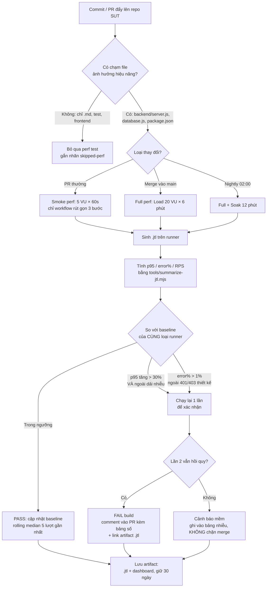

# 10 — Task 3 (10đ): Continuous Performance Testing (G9.6 — Disrupt)

> §Task 3: *"propose a continuous performance-testing model that **watches the SUT's commits**, **decides whether to run** performance tests, and **flags p95 regressions**. Include a **flow chart** and a discussion of the **trade-offs (cost, false alarms)**."*
> Ba động từ đó là ba nhánh bắt buộc của flow chart. Thiếu một cái là thiếu yêu cầu.
> Điểm phân biệt bài khá với bài giỏi: **chạy thật một pipeline** và để nó ra kết quả — kể cả kết quả đỏ.

---

## 1. Mô hình đề xuất



Lưu file mermaid vào `report/task3-flowchart.mmd`, xuất SVG vào `report/assets/task3-flowchart.svg`, và **nhúng cả khối mermaid** vào `report/main-report.md` §4.1 (GitHub render trực tiếp; PDF thì dùng ảnh SVG/PNG).

Xuất ảnh:

```bash
npx -y @mermaid-js/mermaid-cli -i report/task3-flowchart.mmd -o report/assets/task3-flowchart.svg
```

---

## 2. Giải thích từng nhánh quyết định (§4.2 báo cáo)

Flow chart không tự giải thích. Mỗi nút quyết định cần một đoạn nói **vì sao chọn ngưỡng đó**.

| Nút | Quyết định | Vì sao |
|---|---|---|
| **B — lọc theo file** | Chỉ chạy khi chạm `backend/**`, `package.json`, `package-lock.json` | Perf test tốn 6–20 phút runner. Chạy cho mọi commit sửa README là đốt tiền vô ích và làm CI chậm tới mức đội ngũ bắt đầu bỏ qua kết quả — đó là cái giá thật sự đắt |
| **D — chia 3 mức** | PR: smoke 60s · main: Load 6' · nightly: Load + Soak | Đánh đổi giữa **phản hồi nhanh** (PR cần < 5 phút) và **độ tin cậy** (soak cần 12 phút). Rò rỉ bộ nhớ chỉ lộ ra ở lượt dài nên đẩy về nightly |
| **J — baseline** | So với **rolling median 5 lượt gần nhất trên cùng loại runner** | Không so với một con số cố định: runner của GitHub Actions có phương sai lớn giữa các lượt. Median chống nhiễu tốt hơn trung bình. **"Cùng loại runner"** là bắt buộc — `ubuntu-latest` và máy tự host cho số khác hẳn |
| **J — ngưỡng 30%** | p95 tăng > 30% mới tính hồi quy | Đo trên chính bài này: ba lượt Load cùng cấu hình cho p95 lệch nhau tới **{điền số thật của bạn}%** thuần do tải nền của máy. Đặt ngưỡng dưới mức nhiễu tự nhiên = máy báo động giả liên tục |
| **K — chạy lại xác nhận** | Hồi quy phải tái lập ở lượt 2 mới chặn merge | Đây là cơ chế chống báo động giả rẻ nhất: chi phí gấp đôi **chỉ khi** đã có nghi vấn, thay vì tăng gấp đôi mọi lượt |
| **O — cảnh báo mềm** | Không tái lập → ghi nhận, không chặn | Một pipeline chặn merge sai vài lần sẽ bị cả đội tắt đi. Giữ được lòng tin quan trọng hơn bắt được 100% hồi quy |
| **P — artifact 30 ngày** | Giữ `.jtl` thô | Khi có hồi quy thật, cái cần là raw log của **lượt trước đó** để so. Chỉ giữ số tổng hợp thì không điều tra được |

---

## 3. Bảng trade-off (§4.3 báo cáo) — đề đòi đích danh

| Trade-off | Chọn gì | Được | Mất |
|---|---|---|---|
| **Chi phí runner** | lọc theo đường dẫn file + 3 mức độ sâu | ~90% commit không chạy perf → tiết kiệm phần lớn phút CI | commit chạm file "vô hại" vẫn có thể gây hồi quy (vd đổi version dependency trong lockfile) → chấp nhận rủi ro, bù bằng nightly |
| **Báo động giả** | ngưỡng 30% + chạy lại xác nhận | tin cậy được, đội không tắt pipeline | hồi quy nhỏ 10–25% **lọt lưới** → bù bằng theo dõi xu hướng nightly dài hạn |
| **Bỏ sót (false negative)** | nightly có soak | bắt được rò rỉ bộ nhớ, thứ mà PR test không thể thấy | phát hiện muộn tới 24 giờ |
| **Runner chia sẻ vs tự host** | GitHub-hosted cho PR, tự host cho nightly | không tốn hạ tầng cho phần chạy nhiều nhất | GitHub-hosted có phương sai lớn → phải nới ngưỡng → giảm độ nhạy |
| **Độ dài lượt đo** | PR 60s | phản hồi nhanh | 60s **không đủ** qua giai đoạn JIT warm-up của V8 → số của PR chỉ dùng để bắt hồi quy **thô** (2–3 lần), không dùng để chốt SLO |
| **Baseline cố định vs trôi** | rolling median | tự thích nghi khi hạ tầng thay đổi | **nguy cơ "luộc ếch"**: hiệu năng xấu dần từng chút, baseline trôi theo, không ai báo. → chống bằng **ngưỡng tuyệt đối cứng** (vd p95 > 500ms là fail bất kể baseline) |
| **Ai chịu trách nhiệm** | comment tự động vào PR kèm bảng số | người gây hồi quy thấy ngay trong ngữ cảnh | comment bot nhiều quá thành nhiễu → chỉ comment khi **FAIL**, PASS thì chỉ đổi check status |

---

## 4. Chạy thật — đây là chỗ tách bài 8đ khỏi bài 10đ

Một bản đề xuất trên giấy thì ai cũng viết được. **Chạy thật một pipeline, rồi kể lại kết quả thật sự sửa lại chính đề xuất của mình** — đó là mức G9.6 "Disrupt".

### 4.1 `.github/workflows/perf-smoke.yml`

**Prompt:**

> Viết `.github/workflows/perf-smoke.yml` cho repo bài làm HW05 của tôi. Yêu cầu:
> - Trigger: `push` vào `main`, `pull_request`, và `workflow_dispatch` (chạy tay).
> - `paths` filter: chỉ chạy khi chạm `test-plans/**`, `data/**`, `tools/**`, `.github/workflows/**`.
> - Runner `ubuntu-latest`, Java 17 (`actions/setup-java` temurin), Node 22.
> - Bước: (1) clone SUT `https://github.com/ttbhanh/eshop-sut` vào `sut/`; (2) `npm ci` trong `sut/backend` rồi `node database.js` và chạy `node server.js &`, đợi tới khi `GET /api/products` trả 200 (retry 30 lần, 2s/lần); (3) `node tools/seed-perf-data.mjs --users 20 --products 2000`; (4) tải Apache JMeter 5.6.3 từ archive.apache.org, giải nén, cache lại bằng `actions/cache`; (5) chạy plan Load với `-Jthreads=5 -Jduration=60`; (6) `node tools/summarize-jtl.mjs`; (7) `node tools/ci-gate.mjs` (viết ở dưới) để quyết định pass/fail; (8) `actions/upload-artifact` cho `.jtl` + `summary.md`, giữ 30 ngày.
> - In `summary.md` vào `$GITHUB_STEP_SUMMARY` để xem được ngay trên trang Actions.

### 4.2 `tools/ci-gate.mjs` — cổng chặn

**Prompt:**

> Viết `tools/ci-gate.mjs` (Node 22, ESM). Đọc `results/summary.md` (hoặc trực tiếp `.jtl` mới nhất) và `ci/baseline.json`, rồi:
> - Tính p95 tổng thể và error rate **ngoài thiết kế** (loại các sample có label chứa `Login sai` và responseCode 401/403).
> - So với `baseline.json` (chứa mảng 5 giá trị p95 gần nhất của cùng runner): tính **median**.
> - FAIL nếu: p95 > median × 1,3 **hoặc** error rate ngoài thiết kế > 1% **hoặc** p95 > 500ms (ngưỡng tuyệt đối).
> - Nếu PASS: đẩy giá trị mới vào `baseline.json`, giữ 5 phần tử gần nhất.
> - In bảng Markdown so sánh (baseline median / lượt này / % chênh / verdict) ra stdout **và** vào `$GITHUB_STEP_SUMMARY` nếu biến môi trường đó tồn tại.
> - `process.exit(1)` khi FAIL.

### 4.3 Chạy ≥ 4 lượt và ghi lại — `ci/ci-runs.md`

```bash
gh workflow run perf-smoke.yml && sleep 5 && gh run list --workflow=perf-smoke.yml --limit 5
```

Chạy tối thiểu 4 lượt, trong đó **cố tình tạo một lượt ĐỎ** để chứng minh cổng chặn hoạt động:

- Cách rẻ nhất: sửa `ci/baseline.json` cho median thấp giả tạo → lượt sau vượt 30% → FAIL.
- Hoặc thêm `await new Promise(r => setTimeout(r, 30))` vào một handler của SUT trong bước CI → độ trễ thật tăng → FAIL.

Ghi `ci/ci-runs.md`:

```markdown
| # | Lượt | Trigger | p95 đo được | Baseline median | Chênh | Verdict | Link |
|---|---|---|---|---|---|---|---|
| 1 | … | workflow_dispatch | … ms | (chưa có) | — | PASS (khởi tạo baseline) | [run](…) |
| 2 | … | push | … ms | … ms | +…% | PASS | [run](…) |
| 3 | … | push | … ms | … ms | +…% | **FAIL** (cố ý) | [run](…) |
| 4 | … | workflow_dispatch | … ms | … ms | …% | PASS (xác nhận lại) | [run](…) |
```

### 4.4 §4.4 báo cáo — **kết quả thật sửa lại đề xuất của chính mình**

Đây là mục ghi điểm cao nhất của Task 3. Sau khi chạy 4 lượt, đối chiếu với ngưỡng bạn đề xuất ở §4.2:

> **Ví dụ về cách viết** (điền số thật của bạn): *"Ba lượt CI cùng cấu hình cho p95 lần lượt **{a}/{b}/{c} ms** — chênh nhau tới **{d}%** thuần do phương sai của runner GitHub-hosted, trong khi trên máy cá nhân ba lượt Load cùng cấu hình chỉ chênh {e}%. Ngưỡng 30% tôi đề xuất ở §4.3 vì thế là **quá chặt cho runner chia sẻ** — nó sẽ báo động giả ngay ở lượt {n}. Sửa lại: giữ 30% cho runner **tự host**, nới lên **{f}%** cho GitHub-hosted, và bù phần độ nhạy mất đi bằng cách bắt buộc **chạy lại xác nhận** (nhánh K) thay vì FAIL ngay."*

Nếu kết quả thật **không** buộc bạn sửa gì, cũng nói ra điều đó kèm số liệu — nhưng thường là có, vì phương sai runner luôn lớn hơn người ta tưởng.

**Commit:** `feat(ci): pipeline perf-smoke + ci-gate` rồi `docs(task3): 4 luot CI that, sua lai nguong theo phuong sai do duoc`

---

## 5. Checklist Task 3

- [x] Flow chart có đủ **3 động từ của đề**: watch commits · decide whether to run · flag p95 regressions
- [x] Mỗi nút quyết định có một đoạn giải thích **vì sao chọn ngưỡng đó**
- [x] Bảng trade-off có **cost** và **false alarms** (đề nêu đích danh) + ít nhất 4 trade-off khác
- [x] File `.mmd` + ảnh SVG/PNG trong `report/assets/`, nhúng được vào PDF
- [x] `ci/ci-runs.md` có ≥ 4 lượt **thật**, kèm link tới GitHub Actions (Run #2–#5)
- [x] Có ≥ 1 lượt **FAIL** chứng minh cổng chặn hoạt động (2 lượt: #3 cố ý, #4 ngoài kế hoạch)
- [x] §4.4 nói rõ kết quả thật đã sửa lại đề xuất ban đầu như thế nào

---

→ Tiếp: [11-BUG-REPORT-GITHUB-ISSUES.md](11-BUG-REPORT-GITHUB-ISSUES.md)
