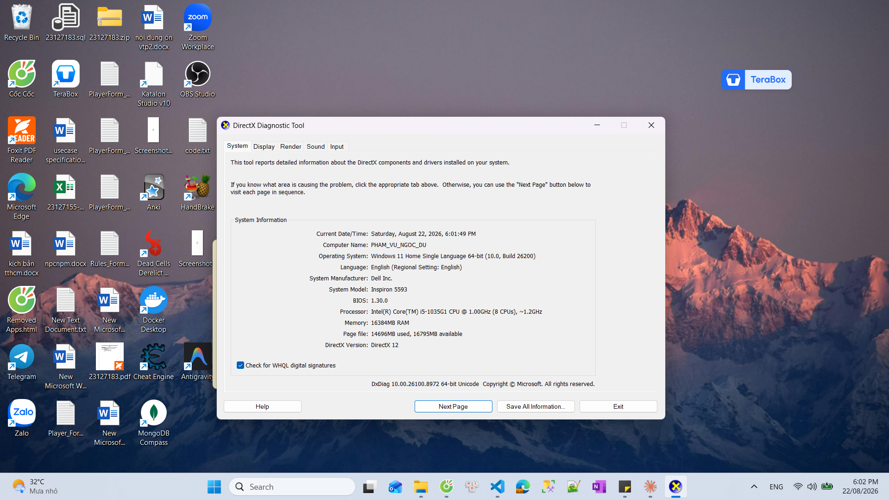

# Hardware Report — 23127183

> Sinh bằng `npm run hardware` (`tools/hardware-report.ps1`). Ảnh dxdiag: `screenshots/hardware-dxdiag.png`.
> §11: hostname phải **khớp với các HW trước** của bạn.

| Mục | Giá trị |
|---|---|
| **Hostname** | `Pham_Vu_Ngoc_Duy` |
| User | |
| OS + build | Windows 11 … |
| CPU | … · … lõi vật lý / … lõi logic · … GHz |
| RAM | … GB |
| Ổ đĩa chứa SUT | |
| Java | Temurin 17.0.19 |
| JMeter | 5.6.3 |
| Node | v22.16.0 |
| Ngày sinh báo cáo | |

## Giới hạn cần công bố

**Load generator (JMeter) và SUT (backend Node) chạy trên CÙNG máy này.** Mọi số đo vì thế bao gồm cả chi phí sinh tải. CPU đỉnh của `java.exe` so với `node.exe` ở từng lượt được ghi trong `results/resources/*.resources.csv` và đối chiếu ở `report/main-report.md` §6.

## Ảnh

